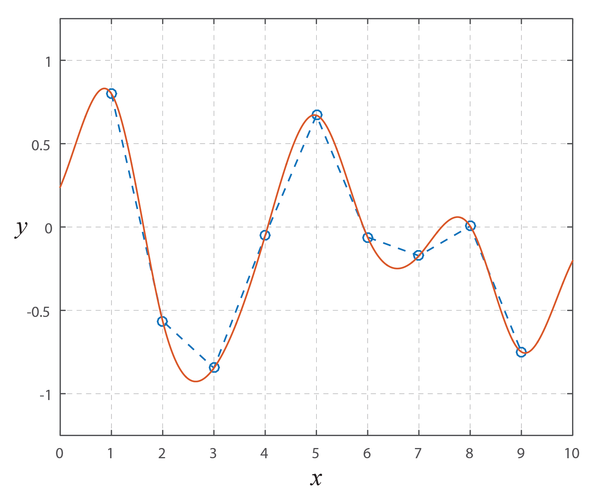
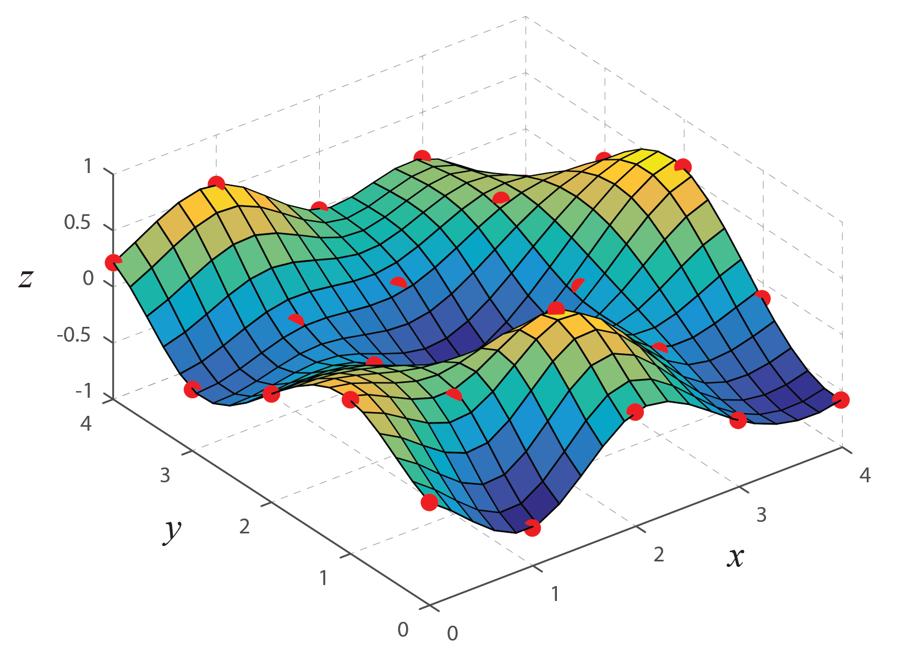

# C++ B-Spline Interpolation

Yet another C++ implementation of [B-spline](https://en.wikipedia.org/wiki/B-spline) [interpolation](https://en.wikipedia.org/wiki/Spline_interpolation). These classes provides simple and efficient methods for 1D & 2D data B-spline interpolation in regular grids.

## Usage

The 1D & 2D B-spline interpolation objects can be instantiated with the following constructors:

```C++
SplineInterpolation1D(float *v, unsigned int n);
SplineInterpolation2D(float **v, unsigned int n, unsigned int m);
```

The class assumes the sample points to be distributed in a regular grid of unit intervals. For the 1D interpolation, the vector *v* contains the *n* corresponding values, while for the 2D interpolation, the array of corresponding values *v* has size *n*&#215;*m*.

The value of query points *u(x)* and *u(x,y)* are calculated with the following methods:   

```C++
float interpolate(float x);
float interpolate(float x, float y);
```

The 2D interpolation calculates and stores the B-spline coefficients of the *x*-axis, solving a single linear system for each new query point. This linear system uses 4 values before and after the query point in order to calculate its value. This can be adjusted by changing the following constant:

```C++
const unsigned int r = 4;
```

This project uses a **submodule** for the calculation of tridiagonal system of equations. When cloning the repository, update the submodule and add a symbolic link to the respective subdirectory.

## Example

The `example1.cpp` file contains a simple example of a 1D interpolation of a random vector:

```C++
#include "SplineInterpolation.h"
#include <stdlib.h>

int main(void)
{
  unsigned int n = 10;

  float *v = new float[n];

  for(unsigned int i=0;i<n;i++) {
    v[i] = ((float)rand()/RAND_MAX)*2-1;
  }

  SplineInterpolation1D *SPL = new SplineInterpolation1D(v,n);

  float x = ((float)rand()/RAND_MAX) * (n-1);

  float u = SPL->interpolate(x);

  delete SPL;

  return 0;
}
```

The following plot shows the interpolated curve calculated from 9 original points:



The `example2.cpp` file contains a simple example of a 2D interpolation of a random surface:

```C++
#include "SplineInterpolation.h"
#include <stdlib.h>
#include <omp.h>

int main(void)
{
  unsigned int n = 30;
  unsigned int m = 20;

  float **v = new float*[n];
  for(unsigned int i=0;i<n;i++) {
    v[i] = new float[m];
    for(unsigned int j=0;j<m;j++) {
      v[i][j] = ((float)rand()/RAND_MAX)*2-1;
    }
  }

  SplineInterpolation2D *SPL = new SplineInterpolation2D(v, n, m);

  float x = ((float)rand()/RAND_MAX) * (n-1);
  float y = ((float)rand()/RAND_MAX) * (m-1);

  float u = SPL->interpolate(x,y);

  delete SPL;

  return 0;
}
```

The following plot shows the interpolated surface calculated from a grid of 5&#215;5 initial points:



The [OpenMP](https://en.wikipedia.org/wiki/OpenMP) parallelization is optional, but has critical impact on the code's performance. 

## Citing

```TeX
@MISC{Kugler2019,
  author = "Mauricio Kugler",
  title = "C++ B-Spline Interpolation",
  year = "2019",
  url = "https://github.com/mauriciokugler/spline-interpolation",
  note = "Version 1.1.0"
}
```

## License

This project is licensed under the [MIT License](LICENSE).